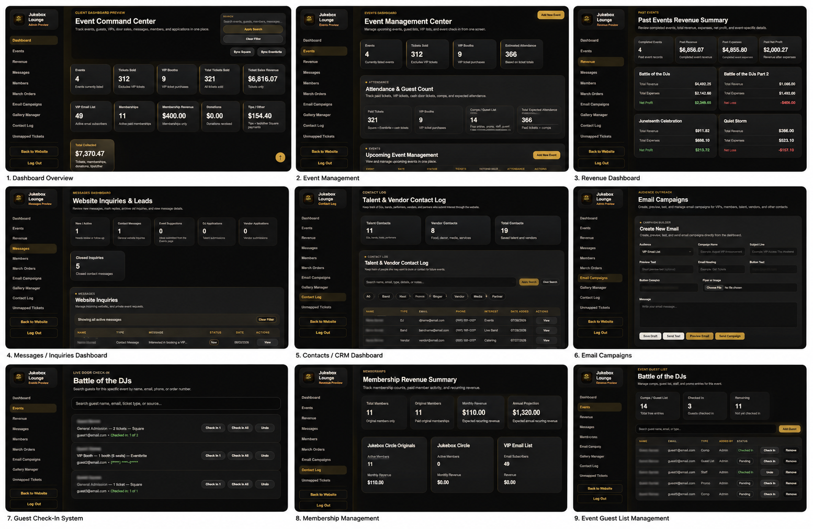
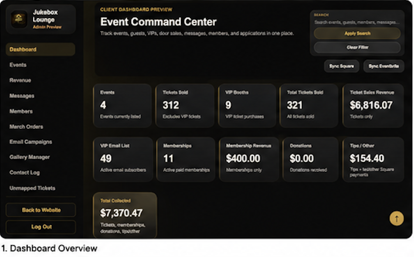
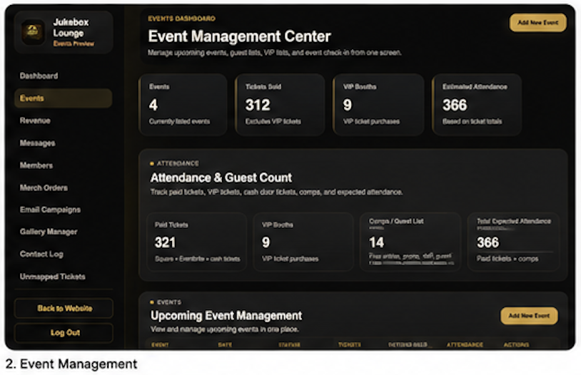
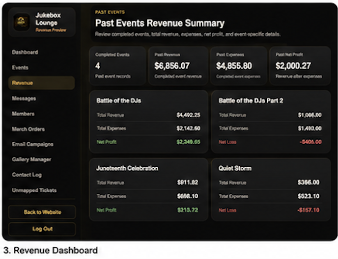
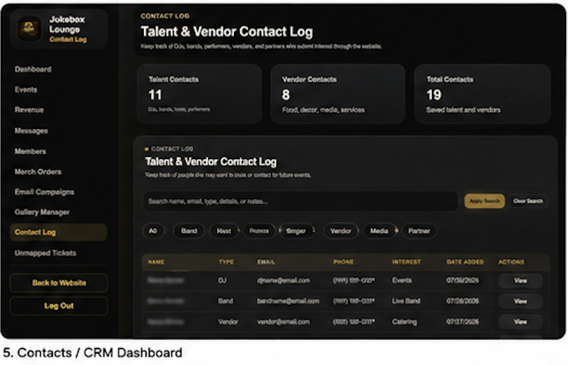
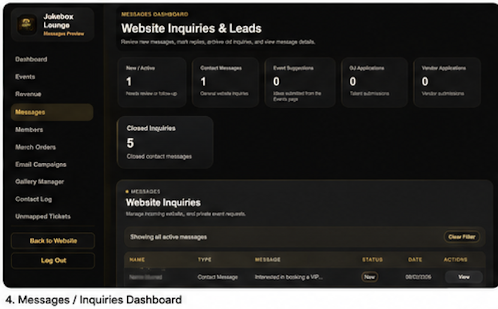
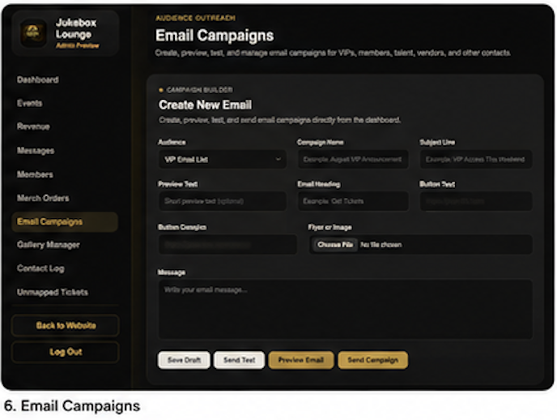
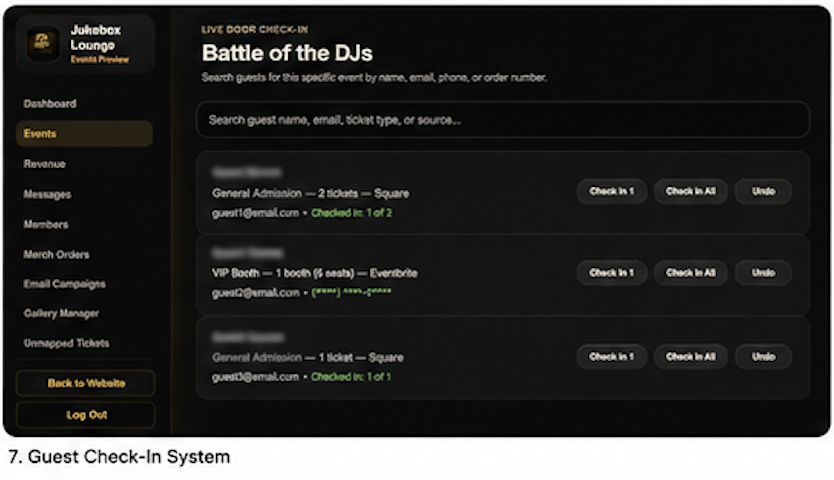
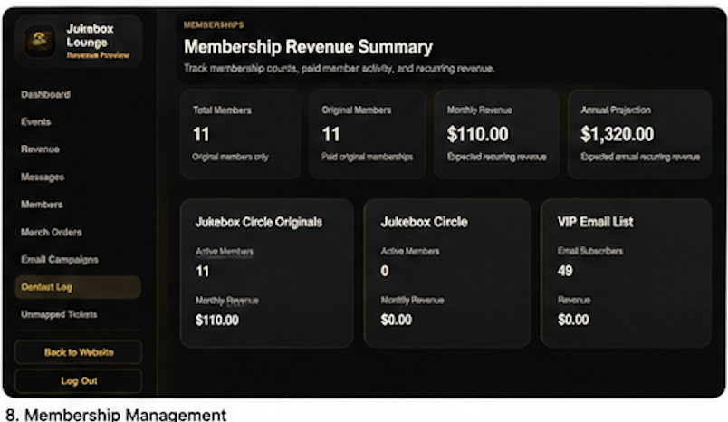
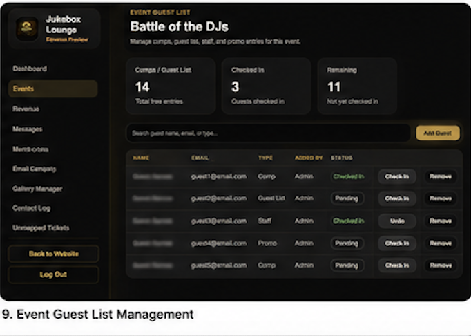

# 🎟️ The Jukebox Event Platform

A full-stack event management platform built to help live entertainment venues manage events, ticket sales, memberships, customer relationships, email campaigns, reporting, and day-to-day operations from one centralized system.

## 🚀 Key Features

- Event creation and management
- Online ticket sales and check-in
- Membership management
- Customer Relationship Management (CRM)
- Email campaign management
- Revenue dashboards and reporting
- Square payment integration
- DJ, vendor, and partnership application workflows
- Administrative dashboard for business operations

## 🛠️ Technology Stack

- Python
- Flask
- SQLite
- HTML
- CSS
- JavaScript
- Square API
- Git & GitHub

## 🎯 My Role

Designed, developed, and maintain the entire platform independently, including:

- Product planning
- UI/UX design
- Backend development
- Database design
- Payment integration
- Dashboard reporting
- Deployment
- Ongoing feature development

## 📈 Project Highlights

- Built a production web application with thousands of lines of code
- Designed a complete CRM for event management
- Integrated Square payments for ticket sales and merchandise
- Built reporting dashboards for revenue and customer insights
- Created automated email campaigns and audience segmentation
- Developed guest check-in and ticket validation workflows
- Continuously maintained and expanded the platform through dozens of feature releases

## 📊 Business Impact

- Supports live event operations from ticket sales through attendee check-in
- Manages customer memberships and recurring engagement
- Processes online ticket and merchandise payments through Square
- Centralizes customer communication with CRM and email campaigns
- Provides business reporting to help monitor sales, attendance, and revenue
- Designed to reduce manual administrative work through workflow automation

## 📸 Screenshots

## 📊 Dashboard Overview

### Executive Dashboard

The central command center provides administrators with a real-time overview of ticket sales, memberships, VIP activity, revenue, and operational metrics from a single dashboard.

---

### Event Operations

Manage upcoming events, attendance, guest lists, VIP booths, ticket inventory, and live event operations from one interface.

---

### Revenue & Financial Reporting

Track ticket sales, memberships, expenses, profit/loss, recurring revenue, and event financial performance.

---

## 💬 CRM & Communications

### Customer Relationship Management

Manage performers, DJs, vendors, partners, and future event contacts in a searchable CRM with categorization and notes.

---

### Website Inquiries & Lead Management

Track website inquiries, contact requests, applications, and follow-up activity from one centralized dashboard.

---

### Email Campaign Builder

Create, preview, test, and send branded email campaigns to VIP members, customers, performers, vendors, and targeted audiences.

---

## 🎟 Operations & Live Event Management

### Live Guest Check-In

Search attendees instantly by name, email, phone number, or order number while checking guests into live events with support for partial and full ticket validation.

---

### Membership Management

Monitor recurring memberships, active subscribers, projected annual revenue, and VIP community engagement from a centralized membership dashboard.

---

### Event Guest List Management

View every attendee, ticket type, payment source, attendance status, and check-in history while managing complete guest lists across multiple events.
